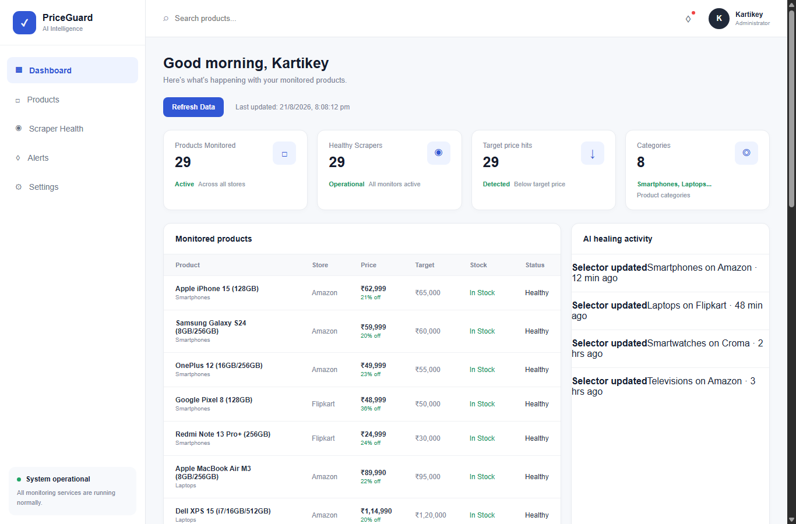
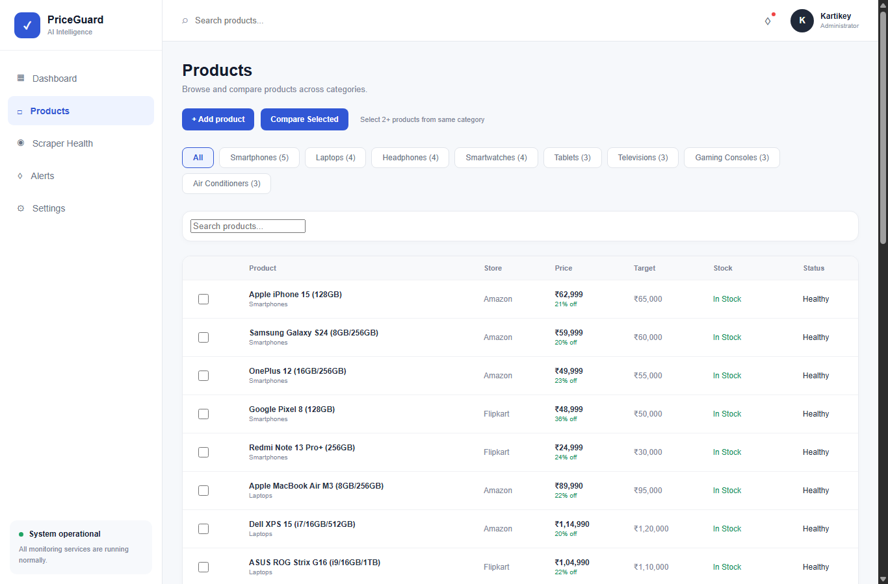
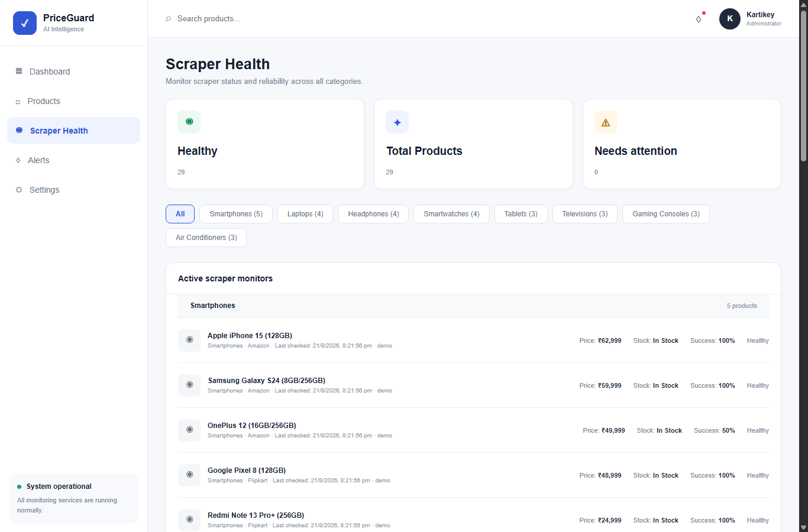
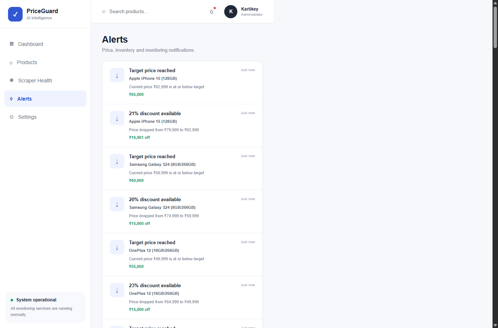

# PriceGuard AI

AI-powered price monitoring and inventory intelligence platform that tracks product prices across multiple Indian e-commerce stores using **Bright Data Scraper Studio** and managed pipelines — with a built-in self-healing loop that keeps scrapers working when websites change.

## Features

- **Multi-store Price Tracking** — Monitors products across Amazon, Flipkart, and Croma
- **Target Price Alerts** — Get notified when product prices drop below your desired target
- **Stock Monitoring** — Tracks product availability and flags out-of-stock items
- **Scraper Studio Integration** — Custom AI-generated scrapers for stores without pre-built pipelines
- **Self-Healing Scrapers** — Automatic detection of broken extractions and one-command repair via Scraper Studio's heal API
- **Real Health Metrics** — Per-product success rates, failure reasons, and heal counts (no fake numbers)
- **Stale-Safe Fallback** — If live extraction fails, last known good data is served with an explicit "stale" flag instead of wrong data
- **Discount Detection** — Identifies products with significant price drops (20%+ off)
- **Dashboard** — Real-time overview of all monitored products, scraper health, and price alerts

## Architecture

```
                        ┌─────────────────────────────────────────────┐
                        │              Frontend (vanilla JS)          │
                        │  Dashboard · Products · Alerts · Scraper    │
                        │  Health · Settings                          │
                        └──────────────────┬──────────────────────────┘
                                           │ /api/*
                        ┌──────────────────▼──────────────────────────┐
                        │            Express server (server.js)       │
                        │  routes/products.js                         │
                        │  mode · refresh · settings · health         │
                        └──────────────────┬──────────────────────────┘
                                           │
              ┌────────────────────────────▼───────────────────────────┐
              │                    lib/healer.js                       │
              │   run → validate → retry → HEAL → re-run → stale-safe  │
              └───────────────┬───────────────────────┬────────────────┘
                              │                       │
        ┌─────────────────────▼───────┐   ┌───────────▼──────────────────┐
        │      lib/scraperEngine.js   │   │   data/cache.json (v2)       │
        │  store routing + validation │   │  products · stats · settings │
        └──────┬──────────┬──────────┬┘   └──────────────────────────────┘
               │          │          │
     ┌─────────▼──┐ ┌─────▼─────┐ ┌──▼──────────┐
     │  Amazon    │ │ Flipkart  │ │   Croma     │
     │ pre-built  │ │ Scraper   │ │  Scraper    │
     │ pipeline:  │ │ Studio    │ │  Studio     │
     │ amazon_    │ │ collector │ │  collector  │
     │ product_   │ │ (AI-built)│ │  (AI-built) │
     │ search     │ └─────┬─────┘ └──┬──────────┘
     └─────────┬──┘       │          │
               │          └──────────┘
               ▼    Bright Data CLI (bdata)
        proxies · CAPTCHA solving · JS rendering · unblocking
```

## How the Scrapers Work

PriceGuard uses the right Bright Data tool for each store:

| Store | Method | Why |
|-------|--------|-----|
| Amazon | Pre-built pipeline `amazon_product_search` via `bdata pipelines` | Managed dataset, structured output out of the box |
| Flipkart | **Scraper Studio** custom collector via `bdata scraper run` | No pre-built pipeline — AI Agent builds and owns the scraper |
| Croma | **Scraper Studio** custom collector via `bdata scraper run` | Same as above |

### The Self-Healing Loop

Websites change constantly. PriceGuard treats extraction failures as first-class signals and repairs scrapers automatically using Scraper Studio's heal API:

```
 1. RUN        bdata pipelines / bdata scraper run
       │
 2. VALIDATE   schema checks on extracted JSON:
       │       • record with valid price exists?
       │       • price > 0 and plausible vs target?
       │       • title matches requested product? (token overlap)
       ▼
 3. RETRY      transient failures get one automatic retry
       │
 4. HEAL       if validation still fails on a Studio collector:
       │       bdata scraper heal <collector_id> "<failure reason>" --auto-approve
       │       → Bright Data AI rewrites the broken selectors,
       │         same collector_id, non-destructive on failure
       ▼
 5. RE-RUN     verify the healed scraper produces valid data
       │
 6. FALLBACK   if everything fails: serve last known good data
               flagged stale:true + raise a "Stale data" alert
```

Every step is tracked per product in `data/cache.json`: attempts, successes, failures, heals, last error. The Scraper Health page shows these **real** success rates — nothing is hardcoded.

## Tech Stack

- **Backend:** Node.js, Express.js
- **Frontend:** Vanilla HTML, CSS, JavaScript
- **Scraping:** Bright Data CLI (`@brightdata/cli`) — Web Scraper API pipelines + Scraper Studio collectors with AI self-healing
- **Stores:** Amazon India, Flipkart, Croma

## Project Structure

```
PriceGuardAI/
├── public/                     # Frontend static files
│   ├── css/style.css           # Styles
│   ├── js/
│   │   ├── api.js              # API client utilities
│   │   ├── app.js              # Sidebar toggle logic
│   │   ├── components/         # Reusable UI components
│   │   └── pages/              # Page-specific scripts
│   ├── index.html              # Dashboard
│   ├── products.html           # Products page
│   ├── alerts.html             # Alerts page
│   ├── scrapers.html           # Scraper health page
│   └── settings.html           # Settings page
├── lib/
│   ├── scraperEngine.js        # Store routing, CLI execution, JSON parsing, validation
│   └── healer.js               # Retry + self-healing orchestration, health stats
├── routes/
│   └── products.js             # API routes & caching
├── scripts/
│   └── setup-scrapers.js       # One-time: creates Studio collectors for Flipkart/Croma
├── data/
│   ├── cache.json              # Product cache v2 + health stats + settings
│   └── collectors.json         # Scraper Studio collector IDs (created by setup)
├── server.js                   # Express server entry point
└── package.json
```

## Prerequisites

- [Node.js](https://nodejs.org/) (v18+)
- A [Bright Data](https://www.brightdata.com/) account (free tier includes 5,000 credits/month)

## Installation

```bash
# Clone the repository
git clone <repository-url>
cd PriceGuardAI

# Install dependencies
npm install
```

## Configuration

Authenticate the Bright Data CLI:

```bash
npx -p @brightdata/cli bdata login
```

Then create the Scraper Studio collectors for Flipkart and Croma (one-time, takes a few minutes — the AI Agent builds both scrapers):

```bash
npm run setup:scrapers
```

This writes `data/collectors.json`. You can inspect or edit each collector in the [Studio dashboard](https://brightdata.com/cp/scrapers) at the printed `view_url`.

Optional `.env`-style environment variable:

```env
PORT=3000
```

## Running the App

```bash
npm start
```

The app will be available at [http://localhost:3000](http://localhost:3000).

The app starts in **Demo mode** (sample data, instant load). To go live, toggle **Settings → Demo mode OFF** — from then on every request runs through the real scraping pipeline with validation, retries, and self-healing.

## Demo Walkthrough (2 minutes)

1. **Open the problem** — prices for the same product vary across Amazon, Flipkart and Croma, and deals disappear fast. PriceGuard watches 29 products across all three stores so you don't have to.
2. **Dashboard** (`/`) — instant overview in demo mode; point out target-price hits and discount alerts.
3. **Go live** — Settings → toggle **Demo mode OFF**, then hit **Refresh Data** on the dashboard. The scraper queue starts filling real prices (Amazon lands within seconds; Flipkart/Croma batch jobs take a few minutes).
4. **Scraper Health** (`/scrapers.html`) — the star of the demo: real success rates per product, heal counts, stale flags. Explain the loop: *run → validate → retry → auto-heal via Scraper Studio → stale-safe fallback*.
5. **Show resilience** — point at `data/cache.json`: every failed extraction is logged with its reason (e.g. *"extracted price ₹439 is implausibly low vs target ₹55,000"*), and wrong data never reaches the UI.
6. **Alerts** (`/alerts.html`) — price drops, stock status, and honest error/stale alerts side by side.

## API Endpoints

| Method | Endpoint | Description |
|--------|----------|-------------|
| GET | `/api/products` | All monitored products with live prices + health stats |
| GET | `/api/products/:id` | Specific product by ID |
| GET | `/api/alerts` | Active alerts (price drops, stock, errors, stale data) |
| GET | `/api/health` | Aggregate scraper health: success rates & heal counts per store |
| GET/POST | `/api/mode` | Get/toggle demo vs live mode |
| GET/POST | `/api/settings` | Monitoring interval (15/30/60/360 minutes) |
| POST | `/api/refresh` | Trigger manual live refresh |
| GET | `/api/categories` | Category → product ID map |
| GET | `/api/compare?ids=a,b` | Compare products within a category |

## Screenshots






## Structured Output

Every scraper returns clean, validated JSON. Raw listing from the Flipkart Scraper Studio collector:

```json
{
  "product_title": "Google Pixel 8 (128 GB)",
  "current_price": { "value": 55999, "currency": "INR", "symbol": "₹" },
  "original_price": { "value": 75999, "currency": "INR", "symbol": "₹" },
  "rating": 4.4,
  "review_count": 3421,
  "product_url": "https://www.flipkart.com/google-pixel-8/p/itm..."
}
```

Normalized and enriched by PriceGuard before hitting the dashboard:

```json
{
  "id": "pixel-8",
  "name": "Google Pixel 8 (128GB)",
  "store": "Flipkart",
  "target": 50000,
  "price": 55999,
  "originalPrice": 75999,
  "availability": "In Stock",
  "rating": 4.4,
  "reviews": 3421,
  "lastChecked": "2026-08-21T14:19:53Z",
  "_source": "live",
  "stats": { "attempts": 1, "successes": 1, "failures": 0, "heals": 0, "successRate": 100 }
}
```

`_source` tells you exactly where data came from: `live` (fresh scrape), `live-healed` (after an auto-repair), `stale` (last known good), or `demo` (sample data). Records that fail validation never reach the UI as wrong prices — they surface as errors or stale entries instead.

## Monitored Product Categories

| Category | Store | Target Price |
|----------|-------|-------------|
| Smartphones | Amazon, Flipkart | ₹30,000–₹65,000 |
| Laptops | Amazon, Flipkart | ₹65,000–₹120,000 |
| Headphones | Amazon, Croma | ₹3,000–₹50,000 |
| Smartwatches | Amazon, Flipkart | ₹15,000–₹45,000 |
| Tablets | Amazon, Flipkart | ₹30,000–₹60,000 |
| Televisions | Flipkart | ₹35,000–₹100,000 |
| Gaming Consoles | Amazon, Flipkart | ₹30,000–₹45,000 |
| Air Conditioners | Flipkart | ₹32,000–₹42,000 |

## License

ISC
